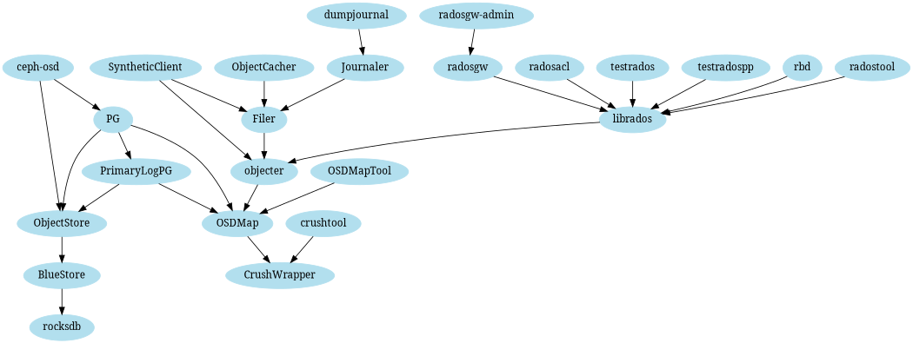
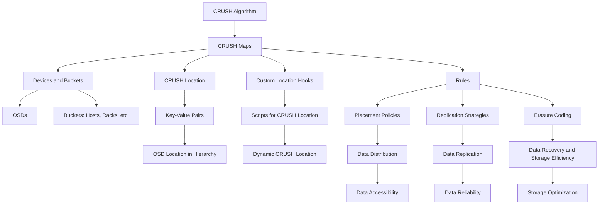
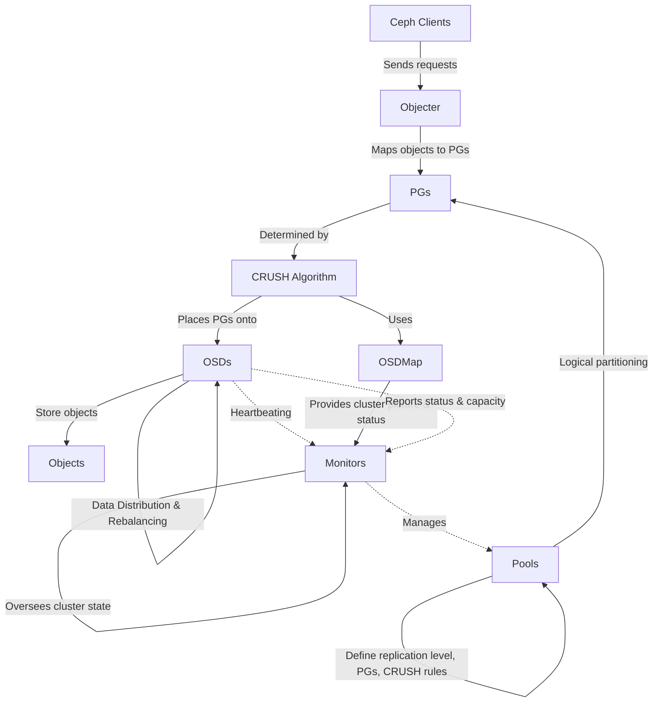
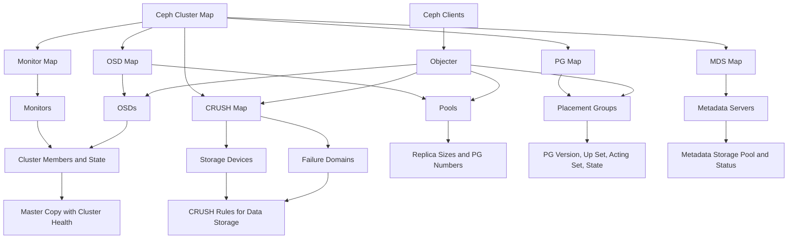

# Diagrams

## Graphviz

This is a graphviz diagram that I found in the Ceph docs. For some reason, the diagram is not rendering on that page for me, so I copied it, and [here is a link to a rendered version][1]

## Mermaid diagrams

I made this diagram based on Ceph docs on [CRUSH maps](https://docs.ceph.com/en/latest/rados/operations/crush-map/)

### Static image

[](https://mermaid.live/edit#pako:eNptk11v2jAUhv-K5WtAQCCIXEwCQkcLDJq0u5jpxalj4IgkjhynW4r47zNO0pWpvkn0vs_58LF9plxGgnp0H8vf_AhKkyd_lxKzJmwWPIcLMokPUqE-Ji-k3f5GprW8hix_qcipNWbMF2_IRU4gjci04CehbwmfBUUsbrV5nW4lOWiU6Y15x2ZFrmXy4ZKFlKcmwcwy39km9G-lBaure4bPdd4iAfCT-QjNOzXpW_KebWPgIhGpJlsZI8eP9irggQUiM3pVPdQKtDj8Dy3ZXEFeKEFmMsL0UJtza67YUpTtnxAXgmwBVRN6Z901C7nCTOdkLxX5chQrC_64bvPfHNCMAoUCxY9lza0tt2F-mUKC_Otk9xbaMh80EB9zrfC1-OQ_WP-x8j9tvbaX1g4am8s3oUp73qGWCg6CzPf76xRT3rS1tSFhFTLh5n7k-Iox6gZ4tMBTkzNGuLEDaz-zpsAm05jge9MVbdFEqAQwMpf4fA3ZUX00J7qjnvmNQJ12dJdeDAeFlmGZcuppVYgWLbLInKaPcFCQUG8PcW7UDFLqnekf6rmdkeP2uiNnMHbGw9Gw36Il9RzXMbrTdfujwaA36LqXFn2X0iTodsbV6o_7vZ47dNwWFRGavtfVG7NPzVb4ZQOubVz-Ao39Emc)

### Mermaid code

This should render in GitHub. If not, see the static image above.

## Interactions between Ceph components

[](https://mermaid.live/edit#pako:eNpVk02P2jAQhv-K5cOeslHCNzlUWhIKKxWBoHtp2INJBnBr7NR2aCnhv3fiZCnNJdH4mZl33omvNFM50IjuhfqVHZm25OtkKwk-L2kMxZHEgoO05p08P3-qNiBzQzT8LMFYU5FJutx9h8yCfm-SJg5bsMIQ5U4MsYqsZsjGKb5aLHZYAph44hJysrtUJEnj9dtmTl7EQWluj6cWThy8EiwDU5ciSlpVkWm63CSGtNC00WeVho_OFfncyjP_QWsoBM-Y5UqSJ7KGTJ1BY__pHfKRmgOasQPE5KEis3ShJMfqH6VmrtQSMw2grEyUBochxjILiD_2S5hlJOHGar4r7113TDCZueJt43m6Ukq0Tn9RB9QoSIEqeJ3kyLglW_v26B1u4984As4gvNokjzRm6lIAOjG_q_bdfiQ7PIQbh99MHXqtbcUFtnO-NuZrdeb5w5wFz2yJVj-5iUvzOLLfeKw0Lr85RSxjBcu4vThwK6lHT7h7xnP896516pbaI5xgSyP8zJn-saVbeUOOlVZtLjKjkdUleLQscvQ44eyg2YlGeyYMRgsmaXSlv2k07PnjYNgddEfjcBCE_YFHLzQKRwN_0Ol3-uPueNwLe8Hg5tE_SmGFwB8Og35vNAq6Qb_THYahRyGvl71o7oa7Iq7FN5dQ67j9BanKBvY)

### Mermaid code for the interactions diagram

Again, this should render in GitHub. If not, see the static image.

## Cluster map focused diagram

This diagram is based on the information found [here](https://docs.ceph.com/en/latest/architecture/#cluster-map)

### Mermaid code for the cluster map diagram

[1]: <https://dreampuf.github.io/GraphvizOnline/#%20%20%20digraph%20object_store%20%7B%0A%20%20%20%20size%3D%227%2C7%22%3B%0A%20%20%20%20node%20%5Bcolor%3Dlightblue2%2C%20style%3Dfilled%2C%20fontname%3D%22Serif%22%5D%3B%0A%0A%20%20%20%20%22testrados%22%20-%3E%20%22librados%22%0A%20%20%20%20%22testradospp%22%20-%3E%20%22librados%22%0A%0A%20%20%20%20%22rbd%22%20-%3E%20%22librados%22%0A%0A%20%20%20%20%22radostool%22%20-%3E%20%22librados%22%0A%0A%20%20%20%20%22radosgw-admin%22%20-%3E%20%22radosgw%22%0A%0A%20%20%20%20%22radosgw%22%20-%3E%20%22librados%22%0A%0A%20%20%20%20%22radosacl%22%20-%3E%20%22librados%22%0A%0A%20%20%20%20%22librados%22%20-%3E%20%22objecter%22%0A%0A%20%20%20%20%22ObjectCacher%22%20-%3E%20%22Filer%22%0A%0A%20%20%20%20%22dumpjournal%22%20-%3E%20%22Journaler%22%0A%0A%20%20%20%20%22Journaler%22%20-%3E%20%22Filer%22%0A%0A%20%20%20%20%22SyntheticClient%22%20-%3E%20%22Filer%22%0A%20%20%20%20%22SyntheticClient%22%20-%3E%20%22objecter%22%0A%0A%20%20%20%20%22Filer%22%20-%3E%20%22objecter%22%0A%0A%20%20%20%20%22objecter%22%20-%3E%20%22OSDMap%22%0A%0A%20%20%20%20%22ceph-osd%22%20-%3E%20%22PG%22%0A%20%20%20%20%22ceph-osd%22%20-%3E%20%22ObjectStore%22%0A%0A%20%20%20%20%22crushtool%22%20-%3E%20%22CrushWrapper%22%0A%0A%20%20%20%20%22OSDMap%22%20-%3E%20%22CrushWrapper%22%0A%0A%20%20%20%20%22OSDMapTool%22%20-%3E%20%22OSDMap%22%0A%0A%20%20%20%20%22PG%22%20-%3E%20%22PrimaryLogPG%22%0A%20%20%20%20%22PG%22%20-%3E%20%22ObjectStore%22%0A%20%20%20%20%22PG%22%20-%3E%20%22OSDMap%22%0A%0A%20%20%20%20%22PrimaryLogPG%22%20-%3E%20%22ObjectStore%22%0A%20%20%20%20%22PrimaryLogPG%22%20-%3E%20%22OSDMap%22%0A%0A%20%20%20%20%22ObjectStore%22%20-%3E%20%22BlueStore%22%0A%0A%20%20%20%20%22BlueStore%22%20-%3E%20%22rocksdb%22%0A%20%20%7D>
